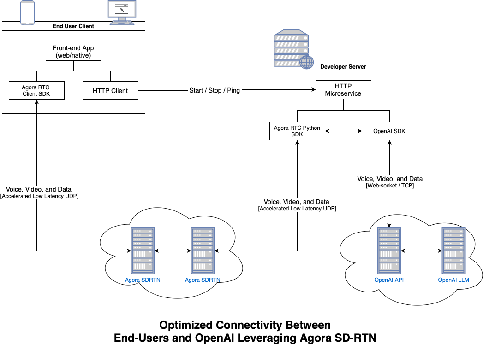

# Realtime Agent

This project demonstrates how to deliver ultra-low latency access to OpenAI with exceptional audio quality using Agora's SD-RTN and OpenAI's Realtime API. By integrating Agora's SDK with OpenAI's Realtime API, it ensures seamless performance and minimal delay across the globe.

## Prerequisites

Before running the demo, ensure you have the following installed and configured:

- Python 3.11 or above

- Agora account:

  - [Login to Agora](https://console.agora.io/en/)
  - Create a [New Project](https://console.agora.io/projects), using `Secured mode: APP ID + Token` to obtain an App ID and App Certificate.

- OpenAI account:

  - [Login to OpenAI](https://platform.openai.com/signup)
  - Go to Dashboard and [obtain your API key](https://platform.openai.com/api-keys).

- Additional Packages:

  - On macOS:
    ```bash
    brew install ffmpeg portaudio
    ```
  - On Ubuntu (verified on versions 22.04 & 24.04):
    ```bash
    sudo apt install portaudio19-dev python3-dev build-essential
    sudo apt install ffmpeg
    ```

## Network Architecture

<!--  -->
<picture>
  <source srcset="architecture-dark-theme.png" media="(prefers-color-scheme: dark)">
  
</picture>

## Organization of this Repo

- `realtimeAgent/realtime` contains the Python implementation for interacting with the Realtime API.
- `realtimeAgent/agent.py` includes a demo agent that leverages the `realtime` module and the [agora-realtime-ai-api](https://pypi.org/project/agora-realtime-ai-api/) package to build a simple application.
- `realtimeAgent/main.py` provides a web server that allows clients to start and stop AI-driven agents.

## Run the Demo

### Setup and run the backend

1. Create a `.env` file for the backend. Copy `.env.example` to `.env` in the root of the repo and fill in the required values:
   ```bash
   cp .env.example .env
   ```
1. Create a virtual environment:
   ```bash
   python3 -m venv venv && source venv/bin/activate
   ```
1. Install the required dependencies:
   ```bash
   pip install -r requirements.txt
   ```
1. Run the demo agent:
   ```bash
   python -m realtime_agent.main agent --channel_name=<channel_name> --uid=<agent_uid>
   ```

### Start HTTP Server

1. Run the http server to start demo agent via restful service
   ```bash
   python -m realtime_agent.main server
   ```
   The server provides a simple layer for managing agent processes.

### API Resources

- [POST /start](#post-start)
- [POST /stop](#post-stop)

### POST /start

This api starts an agent with given graph and override properties. The started agent will join into the specified channel, and subscribe to the uid which your browser/device's rtc use to join.

| Param        | Description                                                                                                                                                            |
| ------------ | ---------------------------------------------------------------------------------------------------------------------------------------------------------------------- |
| channel_name | (string) channel name, it needs to be the same with the one your browser/device joins, agent needs to stay with your browser/device in the same channel to communicate |
| uid          | (int)the uid which ai agent use to join                                                                                                                                |
| system_instruction    | The system instruction for the agent                                                                                                                          |
| voice        | The voice of the agent                                                                                                                                                 |

Example:

```bash
curl 'http://localhost:8080/start_agent' \
  -H 'Content-Type: application/json' \
  --data-raw '{
    "channel_name": "test",
    "uid": 123
  }'
```

### POST /stop

This api stops the agent you started

| Param        | Description                                                |
| ------------ | ---------------------------------------------------------- |
| channel_name | (string) channel name, the one you used to start the agent |

Example:

```bash
curl 'http://localhost:8080/stop_agent' \
  -H 'Content-Type: application/json' \
  --data-raw '{
    "channel_name": "test"
  }'
```

### Front-End for Testing

To test agents, use Agora's [Voice Call Demo](https://webdemo.agora.io/basicVoiceCall/index.html).
